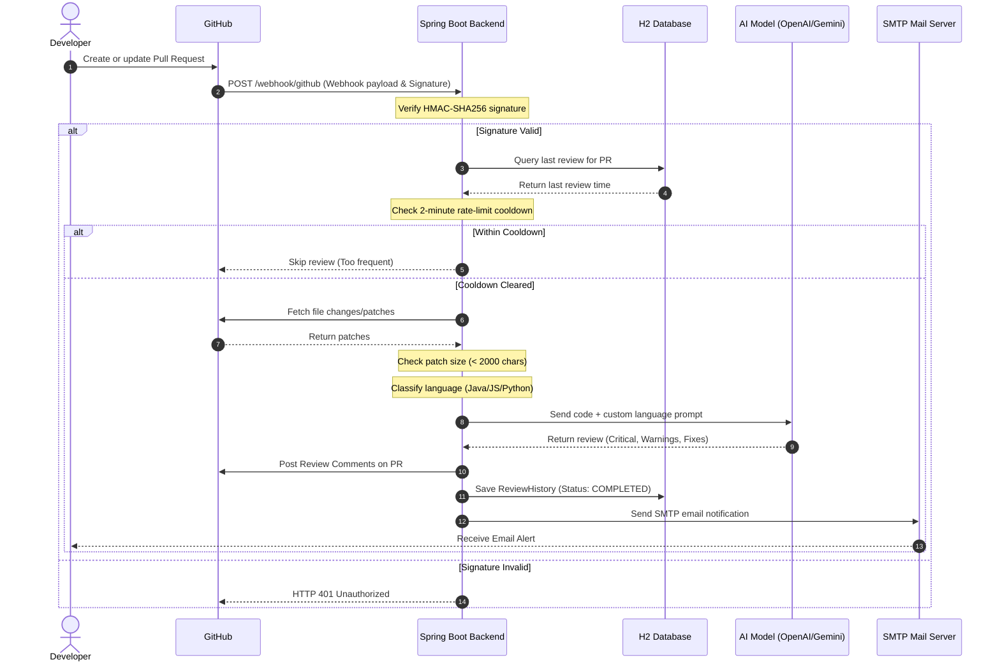
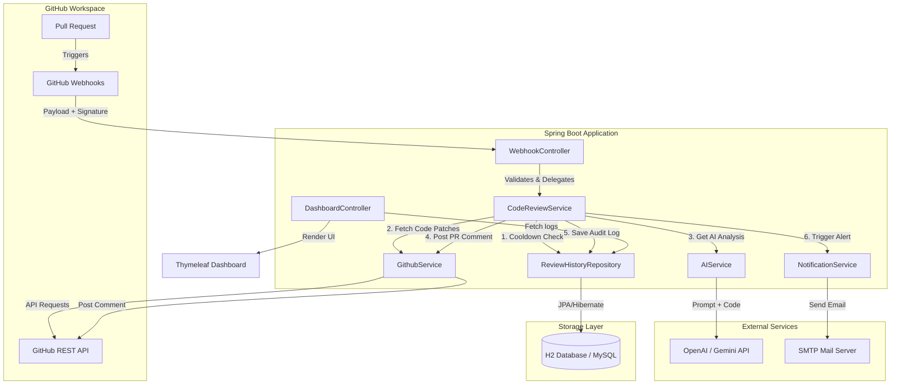

# 🚀 AI GitHub Code Reviewer

> An intelligent, autonomous backend system that automatically reviews GitHub Pull Requests using state-of-the-art AI. It validates PR changes, detects the programming language, applies language-specific review rules, rate-limits requests, records logs in a database, emails alerts to developers, and publishes inline comments or review summaries directly back onto the PR.

---

## 🏗️ System Architecture

This project is built using a decoupled, service-oriented Spring Boot architecture. The system workflow integrates external systems (GitHub, OpenAI/Gemini, SMTP Servers) with local data storage (H2/MySQL Database) and an administrator web interface.

### 🔄 Data & Execution Flow Diagram



### 🧩 Component Dependency Layout



---

## ⚡ Key Features & Subsystems

1. **Automated PR Webhook Receiver (`WebhookController`)**
   - Exposes a `/webhook/github` endpoint.
   - Securely validates incoming requests using an HMAC-SHA256 signature generated with `github.webhook.secret`.
   - Filters and triggers reviews only on `opened` and `synchronize` (updates to PR) actions.

2. **Heuristic Language Classifier (`GithubService`)**
   - Automatically inspects the files modified in the PR.
   - Uses structural heuristics (e.g., matching keyword expressions like `public class`, `def `, `@Service`, `function `) to identify the primary programming language as **Java**, **Python**, or **JavaScript**.

3. **Contextual AI Review System (`AIService` & `CodeReviewService`)**
   - Formulates distinct developer persona prompts for each programming language (e.g. enforcing object-oriented design and Spring Boot conventions for Java, PEP8 style compliance for Python, and asynchronous handling best-practices for JavaScript).
   - Prompts the AI model to output reviews adhering strictly to standard sections: `Critical Issues`, `Warnings`, `Suggestions`, and `Auto-Fix Suggestions`.
   - Protects system resources by skipping PRs where code changes exceed a safe length (2,000 characters), requesting the developer to split the PR.

4. **Intelligent Cooldown & Rate Limiter**
   - Prevents duplicate webhook event bursts from overloading the API quotas.
   - Enforces a **2-minute rate-limit cooldown** per repository-PR pair. If another event is received within the cooldown, the review is skipped.

5. **Persistent Audit Logger (`ReviewHistory`)**
   - Persists metadata about every code review to a local H2 file database (or configurable MySQL instance).
   - Saves: repository name, PR number, final review text, run status (`COMPLETED`, `FAILED`, `SKIPPED`), and timestamps.

6. **Notification Engine (`NotificationService`)**
   - Instantly notifies project maintainers via email (integrates with Gmail's SMTP servers) whenever an AI code review finishes, providing the PR number, final status, and a full review summary.

7. **Visual Operations Console (`DashboardController`)**
   - Renders a responsive dashboard via Thymeleaf templates at `/dashboard`.
   - Displays all historical reviews with color-coded status badges for completion, failures, and skips.

---

## 🛠️ Tech Stack & Technologies

| Layer | Technology | Details |
| :--- | :--- | :--- |
| **Backend Framework** | Java, Spring Boot 3 | Direct API server, dependency injection, and components |
| **Web UI Template Engine** | Thymeleaf | Dynamic HTML generation for the operations console |
| **Database ORM** | Spring Data JPA / Hibernate | Object-Relational Mapping to interact with SQL databases |
| **Data Storage** | H2 Database (File-based local DB) | Stores review history logs under `./data/testdb` |
| **HTTP Clients** | Spring `RestTemplate` & `OkHttpClient` | Calls GitHub REST API & AI Completion services |
| **Security Validation** | Java Cryptography (`Mac`, `SecretKeySpec`) | Validates authenticity of GitHub payloads |
| **Build System** | Maven | Software project management and dependency manager |

---

## 📁 Repository Structure

```
ai-github-code-reviewer
├── README.md                      # Root system-wide README
└── ai-code-reviewer               # Maven application root
    ├── pom.xml                    # Maven configuration and dependencies
    ├── data/                      # Directory for local H2 database storage
    └── src
        ├── main
        │   ├── java/com/aashi/aicodereviewer
        │   │   ├── AiCodeReviewerApplication.java  # Main Boot App Entrypoint
        │   │   ├── controller
        │   │   │   ├── DashboardController.java     # /dashboard routes
        │   │   │   └── WebhookController.java       # GitHub Webhook handler
        │   │   ├── model
        │   │   │   ├── PullRequest.java             # PR Webhook DTO
        │   │   │   ├── PullRequestEvent.java        # Webhook event payload mapping
        │   │   │   ├── Repository.java              # Repo Metadata DTO
        │   │   │   └── ReviewHistory.java           # JPA Entity for DB logging
        │   │   ├── repository
        │   │   │   └── ReviewHistoryRepository.java # JPA Repository interface
        │   │   └── service
        │   │       ├── AIService.java               # OpenAI/Gemini Prompt Engine
        │   │       ├── CodeReviewService.java       # Workflow orchestrator
        │   │       ├── GithubService.java           # GitHub API client (diffs & comments)
        │   │       └── NotificationService.java     # Email SMTP alerter
        │   └── resources
        │       ├── application.properties           # Server & credentials configuration
        │       └── templates
        │           └── dashboard.html               # Thymeleaf Dashboard HTML/CSS
        └── test/                                    # Unit & Integration tests
```

---

## 🚀 Getting Started

### 1️⃣ Clone the Repository

```bash
git clone https://github.com/aashijainn01/ai-github-code-reviewer.git
cd ai-github-code-reviewer/ai-code-reviewer
```

### 2️⃣ Configure Environment Variables

Create your local environment variables or pass them dynamically. You will need:
- **`OPENAI_API_KEY`**: Your OpenAI or Gemini API Key.
- **`GITHUB_TOKEN`**: A GitHub Personal Access Token (PAT) with `repo` scopes to pull code and post review comments.
- **`GITHUB_WEBHOOK_SECRET`**: A secret string shared with GitHub to validate payload hashes.
- **`MAIL_PASSWORD`**: A secure application password for the sender's SMTP email address.

On Windows (PowerShell):
```powershell
$env:OPENAI_API_KEY="your_api_key"
$env:GITHUB_TOKEN="your_github_token"
$env:GITHUB_WEBHOOK_SECRET="your_webhook_secret"
$env:MAIL_PASSWORD="your_smtp_app_password"
```

### 3️⃣ Configure Application Properties

Review the configuration properties in `src/main/resources/application.properties`:

```properties
spring.application.name=ai-code-reviewer
server.port=8080

# GitHub Settings
github.token=${GITHUB_TOKEN}
github.webhook.secret=${GITHUB_WEBHOOK_SECRET}

# AI Engine Settings
openai.api.key=${OPENAI_API_KEY}

# H2 File Database Settings
spring.datasource.url=jdbc:h2:file:./data/testdb
spring.datasource.driver-class-name=org.h2.Driver
spring.datasource.username=sa
spring.datasource.password=
spring.jpa.hibernate.ddl-auto=update
spring.h2.console.path=/h2-console

# SMTP Mail Settings
spring.mail.host=smtp.gmail.com
spring.mail.port=587
spring.mail.username=jaashi117@gmail.com
spring.mail.password=${MAIL_PASSWORD}
spring.mail.properties.mail.smtp.auth=true
spring.mail.properties.mail.smtp.starttls.enable=true
notification.email.to=jaashi117@gmail.com
```

### 4️⃣ Run the Application

Execute using the Maven wrapper:

```bash
# On Windows
./mvnw.cmd spring-boot:run

# On Linux/macOS
./mvnw spring-boot:run
```

The server will boot and bind to `http://localhost:8080`.

---

## 🌐 API Endpoint Catalog

| Endpoint | HTTP Method | Auth Required | Description |
| :--- | :--- | :--- | :--- |
| `/webhook/github` | **POST** | Yes (GitHub Signature) | Processes incoming webhook events for PRs |
| `/dashboard` | **GET** | No | Serves Thymeleaf dashboard tracking historical reviews |
| `/h2-console` | **GET/POST**| Optional | Web GUI to view local database schemas & tables |

---

## 🔐 Webhook Integration Setup

1. **Expose Local Host**: Use a tunneling tool like `ngrok` to expose your local port `8080` to the internet:
   ```bash
   ngrok http 8080
   ```
   Copy the secure forwarding HTTPS URL (e.g. `https://xxxx.ngrok-free.app`).

2. **Configure GitHub Settings**:
   - Go to your GitHub Repository -> **Settings** -> **Webhooks** -> **Add webhook**.
   - **Payload URL**: `https://xxxx.ngrok-free.app/webhook/github`
   - **Content type**: `application/json`
   - **Secret**: Enter the exact value configured in your `${GITHUB_WEBHOOK_SECRET}`.
   - **Which events**: Select **Let me select individual events**, check **Pull requests**, and uncheck everything else.
   - Click **Add webhook**.

---

## 🤖 Sample AI Review Output

When a Pull Request is submitted, the AI reviews the diffs and publishes a structured response:

```markdown
📊 PR Summary:
- Files changed: 1
- Lines added: 15
- Lines removed: 2

🤖 AI Code Review

🔴 Critical Issues:
- Potential NullPointerException on `ReviewHistoryRepository.findTopByRepoNameAndPrNumberOrderByCreatedAtDesc` if a null repository name is provided. Add null-safety checks.

🟡 Warnings:
- No warnings found

🟢 Suggestions:
- Extract constants for recurring string literals inside the custom language classification service.

🛠 Auto-Fix Suggestions:
  Replace:
  `String language = githubService.detectPrimaryLanguage(repo, prNumber);`
  
  With:
  `String language = (repo != null) ? githubService.detectPrimaryLanguage(repo, prNumber) : "Unknown";`
```

---
Give this repository a ⭐ if it helps automate your development workflow!
